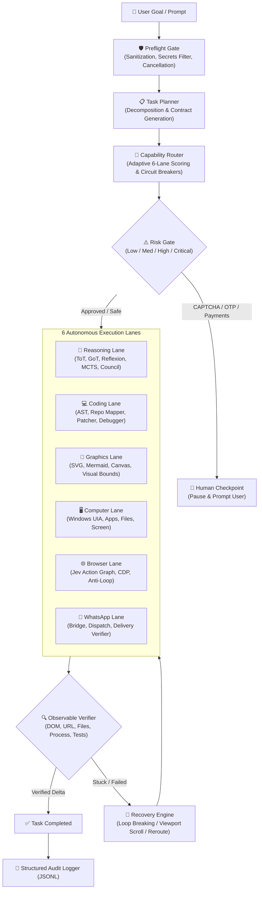

# 🧠 KOSIF Think (Super-Intelligence Edition)

**Unified Hyper-Intelligent Orchestration & Execution Platform for KOSIF**

[]()
[]()
[]()
[]()
[]()

---

## 🎯 Super-Intelligent Architecture

**KOSIF Think** unites the most powerful open-source paradigms across:
1. **Advanced Cognitive Reasoning (ToT, GoT, Reflexion, MCTS, Multi-Agent Council)**
2. **Software Engineering & Autonomous Debugging (AST Analysis, Repo-Mapping, Atomic Patching, Test Sandboxing)**
3. **Multimodal Graphics & Generative UI (Programmatic SVG, Mermaid/DOT Diagrams, Interactive Canvas Dashboards)**
4. **Desktop UI Automation (Windows UIA, App Lifecycle, Screen State Verification)**
5. **Jev-Browser Automation (FNV-1a Stable Action Graph, CDP, Loop Breaker)**
6. **WhatsApp Workflows (Protected Bridge, Message/Media Dispatch, Delivery Verification)**

---

## 🏗️ 6-Lane Architecture & Core Loop



---

## 🧩 Deep Capability Breakdown

### 1. 🧠 Reasoning Lane (`kosif_think.lanes.reasoning`)
- **Tree of Thoughts (ToT)**: Multi-branch exploration with beam search, step-wise evaluation, and backtracking.
- **Graph of Thoughts (GoT)**: Non-linear DAG reasoning supporting thought aggregation, topological sorting, and causal consensus.
- **Reflexion**: Self-improving feedback loop that converts past execution failures into verbal memory priors.
- **Monte Carlo Tree Search (MCTS)**: Rollouts balancing exploration vs. exploitation via UCB1.
- **Council of Personas**: Multi-agent debate between *Safety*, *Speed*, and *Architecture*.

### 2. 💻 Coding Lane (`kosif_think.lanes.coding`)
- **AST Code Intelligence**: Parses Python/JS source, computes cyclomatic complexity, symbol tables, and import trees.
- **Repo Mapper**: PageRank-style repository graph that prioritizes central symbols across large codebases.
- **Atomic Patcher**: Unified diff generator and fuzzy line replacement engine.
- **Test Sandbox**: Isolated subprocess test runner with strict timeouts and stderr capture.
- **Autonomous Debugger**: Fault localization loop: `Run Test -> Parse Traceback -> Localize Line -> Patch -> Verify`.

### 3. 🎨 Graphics Lane (`kosif_think.lanes.graphics`)
- **SVG Builder**: Vector cards, components, charts, and dark-mode badges.
- **Diagram Synthesizer**: Mermaid flowcharts, sequence diagrams, and Graphviz DOT specifications.
- **Generative Canvas**: Self-contained interactive HTML5/Canvas widgets with responsive metrics.
- **Visual Layout Analyzer**: Geometric bounding box overlap detection and visual density coverage.

### 4. 🖥️ Computer Lane (`kosif_think.lanes.computer`)
- Application launching, process monitoring, active window title detection, and safe file I/O.

### 5. 🌐 Browser Lane (`kosif_think.lanes.browser`)
- FNV-1a deterministic DOM hashing, dual-decision engine (<5ms local heuristic + bounded TypeSafe Jev), and loop detection.

### 6. 📱 WhatsApp Lane (`kosif_think.lanes.whatsapp`)
- Pairing validation, encrypted bridge communication, and delivery verification.

---

## 💻 CLI Super-Tools

```bash
# 1. Tree of Thoughts (ToT)
think tot "تصميم نظام كاش موزع عالي التوفر ومقاوم للأعطال"

# 2. Graph of Thoughts (GoT)
think got "بناء معمارية محرك تداول مالي فائق السرعة"

# 3. Reflexion Self-Improvement
think reflexion "attempt_login_without_csrf"

# 4. Monte Carlo Tree Search (MCTS)
think mcts "chess_endgame_or_resource_allocation"

# 5. Code AST Analysis & Repository Mapping
think code analyze src/kosif_think/core/planner.py
think code map .
think code test "python -m unittest discover tests"

# 6. Multimodal Graphics & Generative UI
think graphic diagram "KOSIF Architecture"
think graphic svg "Neural Gateway Card"
think graphic canvas "Live Performance Dashboard"

# 7. Unified Goal Execution
think run "ابحث عن هواتف آيفون 16 في المتصفح"
think run "قم بدفع الفاتورة وسحب المبلغ" --approved

# 8. Platform Health Across All 6 Lanes
think status

# 9. Unified Server & Model Context Protocol (MCP)
think server --port 49400
think mcp
```

---

## 🌐 Unified HTTP & MCP Server (Port `49400`)

| Endpoint | Method | Description |
|---|---|---|
| `/health` | `GET` | Health check & 6 active lanes status |
| `/api/think/plan` | `POST` | Decompose goal into execution contract |
| `/api/think/execute` | `POST` | Execute goal through the complete pipeline |
| `/api/think/status` | `GET` | Circuit breaker status & latency metrics |
| `/api/think/events` | `GET` | Query structured audit traces |

### Model Context Protocol (MCP) Tools:
- `think_execute`: Single-prompt execution across any of the 6 lanes.
- `think_plan`: Inspect proposed decomposition and risk assessment.
- `think_council`: Deliberate difficult design trade-offs.
- `think_tree_of_thoughts`: Run branched ToT search on complex reasoning problems.
- `think_code_action`: AST parsing, repo mapping, test execution, and debugging.
- `think_render_graphic`: Generate Mermaid, SVG, or Canvas visual assets.

---

## 🧪 Comprehensive Verification Suite

```bash
python -c "import sys, unittest; sys.path.insert(0, 'src'); unittest.main(module=None, argv=['unittest', 'discover', 'tests'])"
```
**Results:** `Ran 27 tests in 0.103s - OK` (100% Passing).
