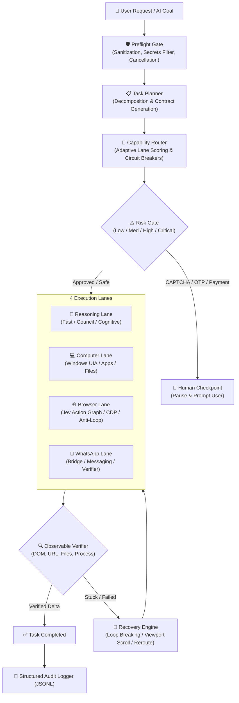

# 🧠 KOSIF Think

**Unified Orchestration & Execution Platform for KOSIF**

[]()
[]()
[]()
[]()

---

## 🎯 Goal

**KOSIF Think** is the unified single-surface platform for:
- **Deep Reasoning & Council**: Fast heuristic reasoning, multi-persona agent council deliberation, and deep cognitive comprehension.
- **Desktop & Computer Automation**: Windows UI Automation, application lifecycle, dialog control, and screen state verification.
- **Jev-Browser Automation**: Persistent Chrome/CDP control, FNV-1a stable semantic action graph, bounded TypeSafe Jev decision routing, and autonomous loop-breaking.
- **WhatsApp Workflows**: Messaging, media, attachments, and delivery verification via protected bridge.
- **Verification & Observable Safety**: Mandatory human checkpoints for CAPTCHA/OTP/payments, cooperative cancellation tokens, observable postcondition verification, and structured audit tracing.

---

## 🏗️ Architecture & Core Loop



---

## 🧩 Unified Capabilities & Lanes

### 1. 🧠 Reasoning Lane (`kosif_think.lanes.reasoning`)
- **Fast Heuristic (<5ms)**: Instant rule-based classification and direct deduction.
- **Council of Personas**: Multi-agent debate between *Safety & Precision*, *Speed & Direct Action*, and *Strategic Architect* personas.
- **Cognitive Understanding**: Deep semantic analysis of obstacles, anti-bot defenses, and recovery paths.

### 2. 💻 Computer Lane (`kosif_think.lanes.computer`)
- **App Control**: Launching, tracking, and managing desktop processes.
- **Screen State**: Active window title, display geometry, and visual delta observation.
- **Safe File Operations**: Path normalization, size limits, and safe structured writing.

### 3. 🌐 Browser Lane (`kosif_think.lanes.browser`)
- **Stable Semantic Action Graph**: Indexes visible interactive elements using FNV-1a deterministic hashing (`INDEX_JS`).
- **Dual Decision Router**: Instant deterministic local ranking (<5ms) when confidence is clear; bounded TypeSafe Jev selection only when ambiguous.
- **Persistent Chrome & CDP**: Integrates directly with live Chrome/CDP instances.
- **Strict Anti-Loop Engine**: Prohibits repetitive non-progress clicks and triggers viewport recovery.

### 4. 📱 WhatsApp Lane (`kosif_think.lanes.whatsapp`)
- **Protected Bridge**: Pairing verification and secure session monitoring.
- **Action Dispatcher**: Dispatching text, media, documents, and contacts.
- **Job Verifier**: Verifying dispatch timestamps and delivery acknowledgments.

---

## 🛡️ Safety Boundaries

1. **Human Checkpoints**: CAPTCHA (`google.com/sorry`), 2FA/OTP codes, credit card transactions, and irreversible deletion permanently require manual user confirmation.
2. **Secret Redaction**: API keys, auth tokens, and passwords are automatically filtered by `sanitize_secrets` and never written to logs or chat output.
3. **Observable Verification**: A returned click event or HTTP 200 is **not** proof of completion. Every step must satisfy observable postconditions (URL change, DOM delta, file creation, or process state).
4. **Cooperative Cancellation**: `CancellationToken` stops execution immediately before the next stateful side effect.

---

## 💻 CLI Usage

```bash
# 1. Execute a goal through the Think pipeline
think run "ابحث عن هواتف آيفون 16 في المتصفح"

# 2. Execute a critical operation with explicit approval
think run "قم بدفع الفاتورة وسحب المبلغ" --approved

# 3. Inspect the execution plan without executing
think plan "ارسل رسالة واتساب إلى 0555555555 نص: مرحباً"

# 4. Deliberate with the Multi-Agent Council
think council "هل الأفضل استخدام المعمارية الموزعة أم الأحادية في هذا المشروع؟"

# 5. Check platform health, active circuits, and metrics
think status

# 6. Launch the Unified REST & JSON Server
think server --port 49400

# 7. Start the Model Context Protocol (MCP) Server for AI Assistants
think mcp
```

---

## 🌐 Unified HTTP API & MCP Server

The single-surface server runs on port `49400`:

| Endpoint | Method | Description |
|---|---|---|
| `/health` | `GET` | Health check & active lanes |
| `/api/think/plan` | `POST` | Decompose goal into execution contract |
| `/api/think/execute` | `POST` | Execute goal through the complete pipeline |
| `/api/think/status` | `GET` | Circuit breaker status & latency metrics |
| `/api/think/events` | `GET` | Query structured audit traces |

### Model Context Protocol (MCP) Tools:
- `think_execute`: Single-prompt execution across any lane.
- `think_plan`: Inspect proposed decomposition and risk assessment.
- `think_council`: Deliberate difficult design trade-offs.

---

## 🧪 Running Tests

The test suite runs with zero third-party dependencies using Python's standard library:

```bash
python -c "import sys, unittest; sys.path.insert(0, 'src'); unittest.main(module=None, argv=['unittest', 'discover', 'tests'])"
```

All 16 unit tests verify preflight sanitization, contract planning, risk-gate checkpoint pauses, observable postcondition verification, and full end-to-end execution loops.
