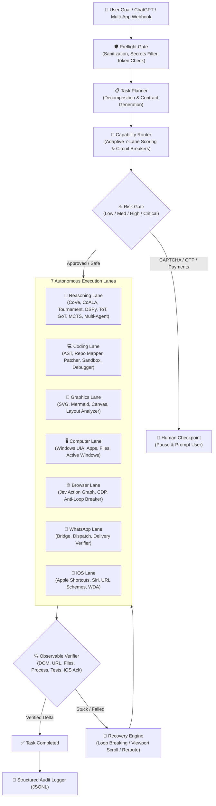

# 🧠 KOSIF Think (Super-Intelligence Edition)

**Unified Hyper-Intelligent Orchestration & Execution Platform for KOSIF**

[]()
[]()
[]()
[]()
[]()
[]()

---

## 🎯 Super-Intelligent Architecture

**KOSIF Think** unites the most powerful open-source cognitive and execution paradigms:
1. **Advanced Cognitive Reasoning**: Chain-of-Verification (CoVe), CoALA 4-tier memory, Tournament Verifiers, Tree of Thoughts (ToT), Graph of Thoughts (GoT), Reflexion, MCTS, DSPy prompt optimization, and Multi-Agent state graphs.
2. **ChatGPT & Custom GPT Bridge**: Native OpenAI `/v1/chat/completions` and `/v1/models` endpoints, plus auto-generated OpenAPI 3.0 schema at `/openapi.json` for plug-and-play ChatGPT Actions.
3. **iPhone Automation Lane (`IOSLane`)**: Trigger Siri speech, run Apple Shortcuts, launch iOS apps via URL schemes, push notifications, and coordinate tapping via WebDriverAgent.
4. **Multi-App Hub**: Webhook dispatchers and payload formatters for Discord, Telegram, Slack, and n8n.
5. **Software Engineering & Debugging**: AST analysis, Repo-Mapping, atomic patching, and isolated test sandboxing.
6. **Multimodal Graphics & Generative UI**: Programmatic SVG generation, Mermaid/DOT diagrams, and interactive Canvas dashboards.
7. **Desktop UI Automation**: Windows UIA, application lifecycle, and screen state verification.
8. **Jev-Browser Automation**: FNV-1a stable action graph, CDP integration, and anti-loop breakers.
9. **WhatsApp Workflows**: Encrypted bridge, message/media dispatch, and delivery verification.

---

## 🏗️ 7-Lane Architecture & Core Loop



---

## 🧩 Deep Capability Breakdown

### 1. 🧠 Reasoning Lane (`kosif_think.lanes.reasoning`)
- **Chain-of-Verification (CoVe)**: Meta AI 4-phase hallucination-reduction pipeline: baseline draft $\rightarrow$ verification questions $\rightarrow$ independent verification $\rightarrow$ verified synthesis.
- **CoALA Cognitive Memory**: Princeton/DeepMind 4-tier human-like memory architecture:
  - *Working Memory*: Active task focus, current entities, and scratchpad.
  - *Episodic Memory*: Temporal log of past agent actions, outcomes, and success markers.
  - *Semantic Memory*: Ground-truth facts, invariants, and safety boundaries.
  - *Procedural Memory*: Executable recipes and reusable skills.
- **Tournament Verifier**: Pairwise single-elimination tournament comparing candidate plans across correctness, safety, and efficiency.
- **DSPy Declarative Optimization**: Compiles task signatures into optimized reasoning pipelines with automatic metric scoring.
- **Multi-Agent Cyclic Graph**: Supervisor, Researcher, Coder, and Critic agent nodes cooperating in state loops (inspired by LangGraph/AutoGen).
- **Tree of Thoughts (ToT)**: Multi-branch exploration with beam search and backtracking.
- **Graph of Thoughts (GoT)**: Non-linear DAG reasoning supporting thought aggregation and causal consensus.
- **Reflexion**: Verbal self-reflection turning past execution failures into episodic memory priors.
- **Monte Carlo Tree Search (MCTS)**: Rollouts balancing exploration vs. exploitation via UCB1.
- **Repo Intelligence**: Automatic GitHub repository search and architectural pattern ingestion.

### 2. 📲 iOS & iPhone Lane (`kosif_think.lanes.ios`)
- **Shortcuts Bridge**: Direct execution of Apple Shortcuts via URL schemes (`shortcuts://run-shortcut?name=...`).
- **Siri Voice Synthesis**: Programmatic text-to-speech triggers on iPhone.
- **App Launcher**: Instant opening of iOS apps (WhatsApp, Maps, Mail, Phone, Settings, Shortcuts) via registered URI schemes.
- **Push Notifications**: Send alerts directly to user's iOS lockscreen.
- **WebDriverAgent (WDA)**: Remote tap, swipe, and home button automation for iOS devices.
- **Polling Server**: Built-in iOS command queue (`/api/ios/poll`, `/api/ios/ack`) allowing native Shortcuts or companion apps to consume and acknowledge tasks.

### 3. 🔌 ChatGPT & Multi-App Connectors (`kosif_think.connectors`)
- **OpenAI Compatible Bridge**: Drop-in `/v1/chat/completions` and `/v1/models` endpoints compatible with ChatGPT, LiteLLM, and any OpenAI SDK client.
- **Custom GPT Actions**: Automatic OpenAPI 3.0 specification generated dynamically at `/openapi.json`.
- **Multi-App Webhook Dispatcher**: Direct payload formatting and forwarding to Discord, Telegram, Slack, and n8n webhooks.

### 4. 💻 Coding Lane (`kosif_think.lanes.coding`)
- **AST Code Intelligence**: Parses Python/JS source, computes cyclomatic complexity, symbol tables, and import trees.
- **Repo Mapper**: PageRank-style repository graph that prioritizes central symbols across codebases.
- **Atomic Patcher**: Unified diff generator and fuzzy line replacement engine.
- **Test Sandbox**: Isolated subprocess test runner with strict timeouts and stderr capture.
- **Autonomous Debugger**: Fault localization loop: `Run Test -> Parse Traceback -> Localize Line -> Patch -> Verify`.

### 5. 🎨 Graphics Lane (`kosif_think.lanes.graphics`)
- **SVG Builder**: Vector cards, components, charts, and dark-mode badges.
- **Diagram Synthesizer**: Mermaid flowcharts, sequence diagrams, and Graphviz DOT specifications.
- **Generative Canvas**: Self-contained interactive HTML5/Canvas widgets with responsive metrics.
- **Visual Layout Analyzer**: Geometric bounding box overlap detection and visual density coverage.

### 6. 🖥️ Computer Lane (`kosif_think.lanes.computer`)
- Application launching, process monitoring, active window title detection, and safe file I/O.

### 7. 🌐 Browser Lane (`kosif_think.lanes.browser`)
- FNV-1a deterministic DOM hashing, dual-decision engine (<5ms local heuristic + bounded TypeSafe Jev), and anti-loop detection.

### 8. 📱 WhatsApp Lane (`kosif_think.lanes.whatsapp`)
- Pairing validation, encrypted bridge communication, and delivery verification.

---

## 💻 CLI Super-Tools

```bash
# 1. Chain-of-Verification (CoVe)
think cove "Autonomous code deployment is free of defects"

# 2. CoALA Cognitive Memory
think coala "browser payment safety"

# 3. Tournament Verifier
think tournament "Optimize database latency under 10k RPS"

# 4. DSPy Declarative Optimization
think dspy "Extract and categorize financial invoices"

# 5. Multi-Agent State Graph
think agent-graph "Build real-time collaborative whiteboard"

# 6. GitHub Repository Intelligence
think repo-intel "dspy prompt optimization"

# 7. iPhone Automation (Shortcuts / Siri / Apps)
think ios speak "مرحباً بك، تم تنفيذ العملية بنجاح على الآيفون"
think ios app "WhatsApp"
think ios shortcut "MyBackupShortcut"

# 8. Coding Intelligence
think code analyze src/kosif_think/core/planner.py
think code map .
think code test "python -m unittest discover tests"

# 9. Multimodal Graphics
think graphic diagram "KOSIF Architecture"
think graphic svg "Neural Gateway Card"

# 10. Platform Status & Server
think status
think server --port 49400
```

---

## 🌐 Unified HTTP & OpenAI Server (Port `49400`)

| Endpoint | Method | Description |
|---|---|---|
| `/v1/chat/completions` | `POST` | OpenAI-compatible endpoint for ChatGPT & OpenAI clients |
| `/v1/models` | `GET` | Lists available KOSIF Think cognitive models |
| `/openapi.json` | `GET` | OpenAPI 3.0 specification for Custom GPT Actions |
| `/api/ios/poll` | `GET` | Long-polling endpoint for iOS Shortcuts / Companion |
| `/api/ios/ack` | `POST` | Acknowledge iOS action execution with observable proof |
| `/api/ios/action` | `POST` | Enqueue an iPhone action (Siri, Shortcuts, Tap, App) |
| `/api/think/plan` | `POST` | Decompose goal into execution contract |
| `/api/think/execute` | `POST` | Execute goal through the complete pipeline |
| `/api/think/status` | `GET` | Circuit breaker status & latency metrics across all 7 lanes |
| `/health` | `GET` | Health check & 7 active lanes status |

---

## 🧪 Comprehensive Verification Suite

```bash
python -c "import sys, unittest; sys.path.insert(0, 'src'); unittest.main(module=None, argv=['unittest', 'discover', 'tests'])"
```
**Results:** `Ran 43 tests in 2.010s - OK` (100% Passing).
