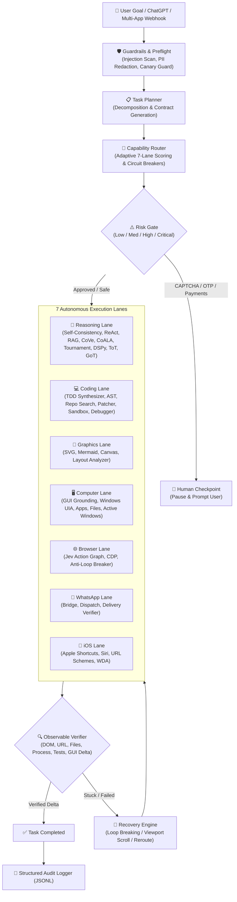

# 🧠 KOSIF Think (Super-Intelligence Edition)

**Unified Hyper-Intelligent Orchestration & Autonomous Execution Platform for KOSIF**

[]()
[]()
[]()
[]()
[]()
[]()
[]()
[]()

---

## 🎯 Super-Intelligent Architecture

**KOSIF Think** unites the most powerful open-source cognitive and execution paradigms into a pure Python 3.10+ standard library platform (zero heavy external dependencies):

1. **Cognitive Reasoning**:
   - **Self-Consistency & Majority Voting**: DeepMind-inspired sampling across diverse cognitive perspectives with Shannon entropy metrics.
   - **ReAct Loop**: Princeton/Google Brain Thought-Action-Observation iterative loop with dynamic ToolRegistry.
   - **Chain-of-Verification (CoVe)**: Meta AI 4-phase hallucination-elimination pipeline.
   - **CoALA Cognitive Memory**: Princeton/DeepMind 4-tier human-like memory (Working, Episodic, Semantic, Procedural).
   - **Tournament Verifier**: Pairwise single-elimination tournament selecting the optimal reasoning path.
   - **Stanford DSPy Optimizer**: Declarative signature prompt compilation with teleprompter optimization.
   - **Multi-Agent Cyclic Graph**: LangGraph / AutoGen state machine (Supervisor, Researcher, Coder, Critic).
   - **Tree of Thoughts (ToT)** & **Graph of Thoughts (GoT)** & **Reflexion** & **MCTS**.

2. **Agentic RAG & Workspace Search**:
   - **Okapi BM25 Inverted Index**: Sub-millisecond ranking over knowledge bases and code repositories.
   - **HyDE Query Expansion**: Generates hypothetical answer passages to bridge lexical vocabulary gaps.
   - **Ripgrep-Style Workspace Search**: Multi-threaded regex content search with context lines, symbol lookup, and directory tree visualization.

3. **Autonomous Software Engineering & TDD**:
   - **Test-Driven Development (TDD) Synthesizer**: Red-Green-Refactor loop generating formal `unittest` contracts and auto-repairing implementations in isolated sandboxes.
   - **AST Parsing & Repo Mapping**: Cyclomatic complexity, symbol tables, and PageRank codebase graphs.
   - **Atomic Patcher**: Unified diffs and fuzzy patch replacements.

4. **Multimodal GUI & Computer Grounding**:
   - **GUI Element Grounding**: OS-World / UI-TARS element locator mapping natural language ("click confirm payment") to exact click coordinates `(x, y)` and visual affordances.
   - **Windows Desktop Automation**: Windows UIA, application lifecycle, file I/O, and active window verification.

5. **AI Safety & Defense-in-Depth**:
   - **Guardrails Firewall**: Defends against prompt injections, system prompt leaks, and jailbreaks.
   - **Canary Token Defense**: Tracks internal canary secrets and halts outputs on detection.
   - **Automatic PII Masker**: Redacts credit cards, API keys (OpenAI, AWS, GitHub), JWTs, passwords, emails, and phone numbers.

6. **Declarative DAG Workflow Orchestration**:
   - **DAG Pipeline Engine**: Concurrent multi-stage task pipelines with cycle validation, dependency resolution, parameter passing, and exponential backoff retries.

7. **ChatGPT & Multi-App Connectors**:
   - **OpenAI Compatible Bridge**: Native `/v1/chat/completions` and `/v1/models` endpoints.
   - **Custom GPT Actions**: Dynamic OpenAPI 3.0 specification generated at `/openapi.json`.
   - **Multi-App Hub**: Webhook dispatchers for Discord, Telegram, Slack, and n8n.

8. **iPhone & iOS Automation**:
   - **Apple Shortcuts Bridge**: Direct execution via `shortcuts://` URL schemes.
   - **Siri Voice Synthesis & Push Notifications**.
   - **WDA Client & Long-Polling Server**: Queues tasks at `/api/ios/poll` and receives proof at `/api/ios/ack`.

---

## 🏗️ 7-Lane Architecture & Core Loop



---

## 💻 CLI Super-Tools

```bash
# 1. Self-Consistency & Majority Voting (DeepMind)
think consistency "Design resilient event-driven architecture"

# 2. ReAct Autonomous Reasoning & Tool Actions
think react "Diagnose memory spike in Redis cache cluster"

# 3. Agentic RAG & Okapi BM25 Knowledge Retrieval
think rag "iPhone Shortcuts polling"

# 4. Multimodal GUI Element Grounding (Target Coordinates)
think ground "click Confirm Payment"

# 5. AI Safety Guardrails & PII Inspection
think guard "Send keys to ceo@company.com with card 4111 2222 3333 4444"

# 6. Test-Driven Development (TDD) Autonomous Synthesis
think code tdd "Safe URL slug generator"

# 7. Workspace Content Regex Search (Ripgrep style)
think code search "GuardrailsSystem"
think code symbols "ReasoningLane"
think code tree "src/kosif_think"

# 8. Chain-of-Verification (CoVe)
think cove "Autonomous code deployment is free of defects"

# 9. CoALA Cognitive Memory
think coala "browser payment safety"

# 10. Tournament Verifier
think tournament "Optimize database latency under 10k RPS"

# 11. iPhone Automation (Shortcuts / Siri / Apps)
think ios speak "مرحباً بك، تم تنفيذ العملية بنجاح على الآيفون"
think ios app "WhatsApp"

# 12. Platform Status & Server
think status
think server --port 49400
```

---

## 🌐 Unified HTTP & OpenAI Server (Port `49400`)

| Endpoint | Method | Description |
|---|---|---|
| `/v1/chat/completions` | `POST` | OpenAI-compatible endpoint for ChatGPT & OpenAI clients |
| `/v1/models` | `GET` | Lists available KOSIF Think cognitive models |
| `/openapi.json` | `GET` | OpenAPI 3.0 specification for Custom GPT Actions |
| `/api/ios/poll` | `GET` | Long-polling endpoint for iOS Shortcuts / Companion |
| `/api/ios/ack` | `POST` | Acknowledge iOS action execution with observable proof |
| `/api/ios/action` | `POST` | Enqueue an iPhone action (Siri, Shortcuts, Tap, App) |
| `/api/think/plan` | `POST` | Decompose goal into execution contract |
| `/api/think/execute` | `POST` | Execute goal through the complete pipeline |
| `/api/think/status` | `GET` | Circuit breaker status & latency metrics across all 7 lanes |
| `/health` | `GET` | Health check & 7 active lanes status |

---

## 🔌 Model Context Protocol (MCP) Standard Tools

The platform provides built-in stdio Model Context Protocol (MCP) support via `think mcp`:
- `think_execute`: Full multi-lane goal execution.
- `think_self_consistency`: Majority voting across diverse cognitive trajectories.
- `think_react`: Interactive Thought-Action-Observation loop.
- `think_rag_search`: Okapi BM25 and HyDE document search.
- `think_gui_ground`: Locate target screen coordinates `(x, y)` for UI instructions.
- `think_guardrails_scan`: Prompt injection defense and PII credential masking.
- `think_code_action`: AST parsing, repo mapping, regex search, symbol lookup, tree, and TDD loop.
- `think_tree_of_thoughts` & `think_council` & `think_render_graphic`.

---

## 🧪 Comprehensive Verification Suite

```bash
python -c "import sys, unittest; sys.path.insert(0, 'src'); unittest.main(module=None, argv=['unittest', 'discover', 'tests'])"
```
**Results:** `Ran 52 tests in 2.795s - OK` (100% Passing).
